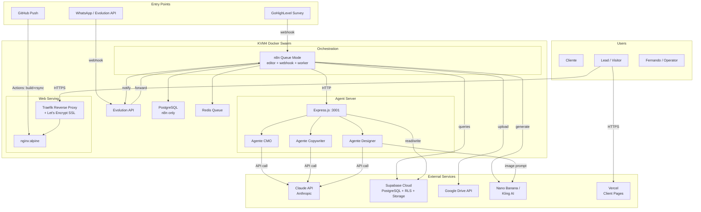
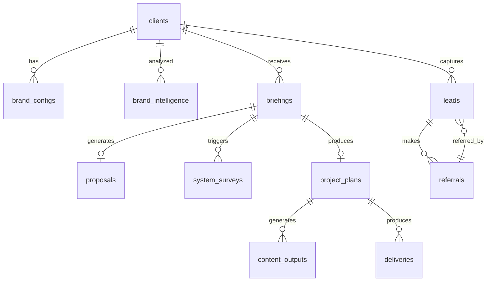
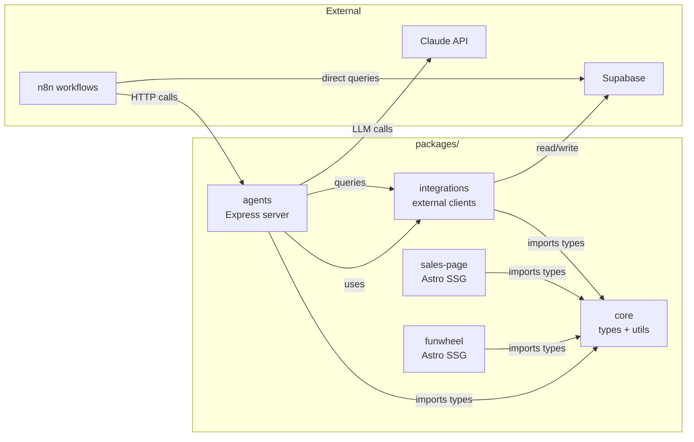
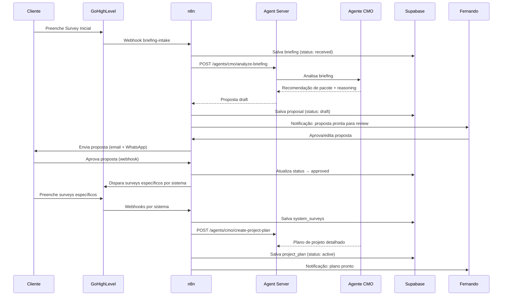
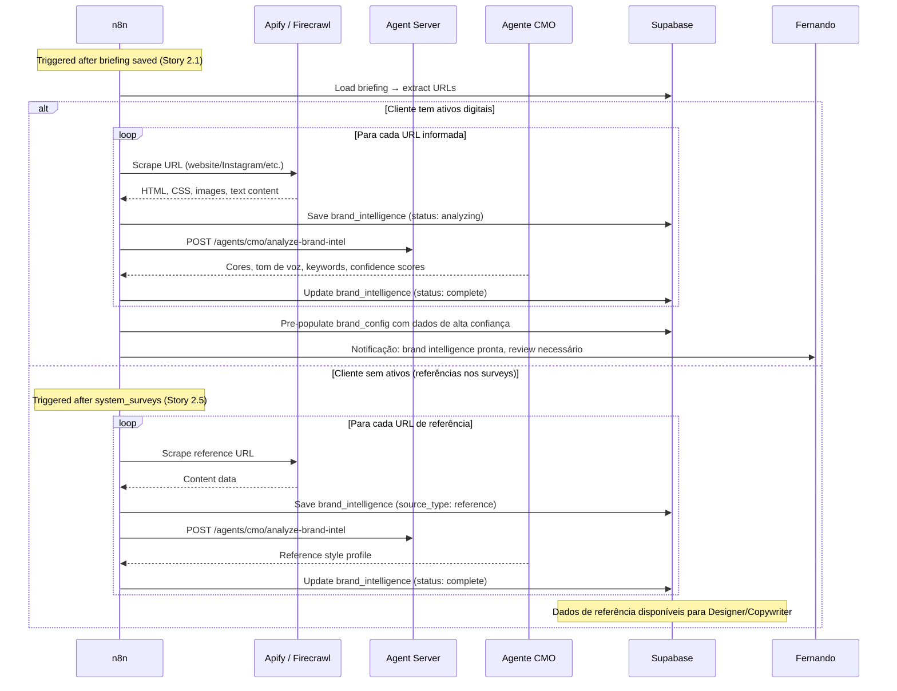
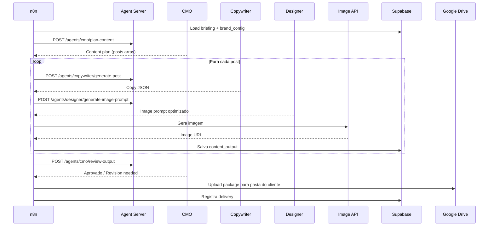
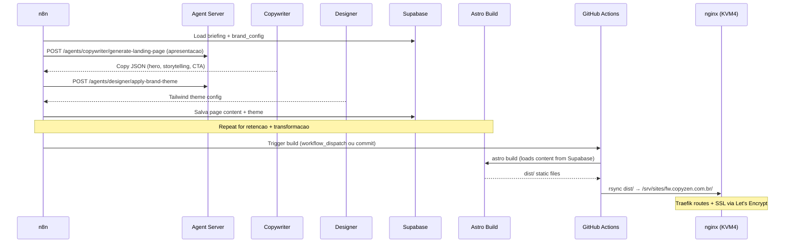
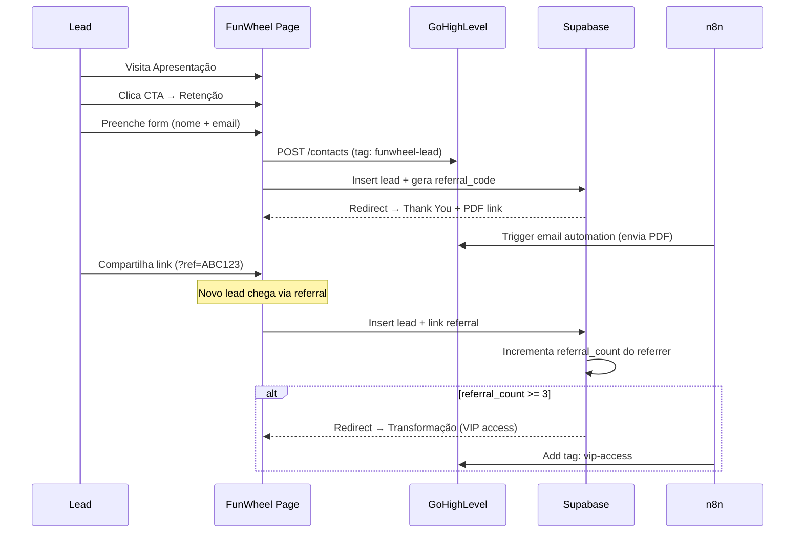
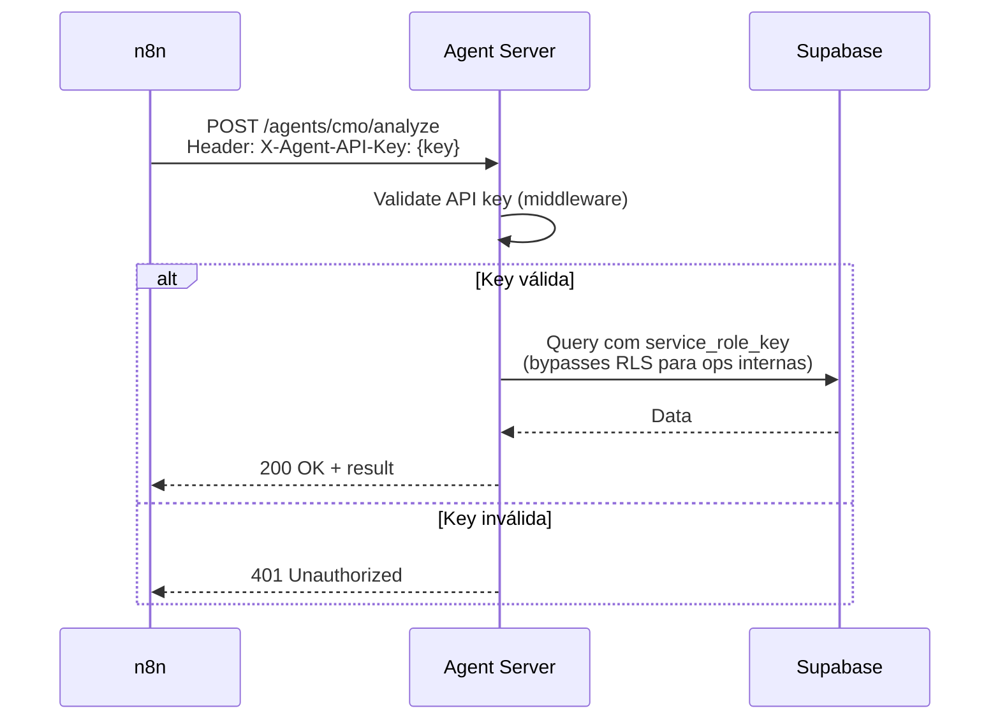
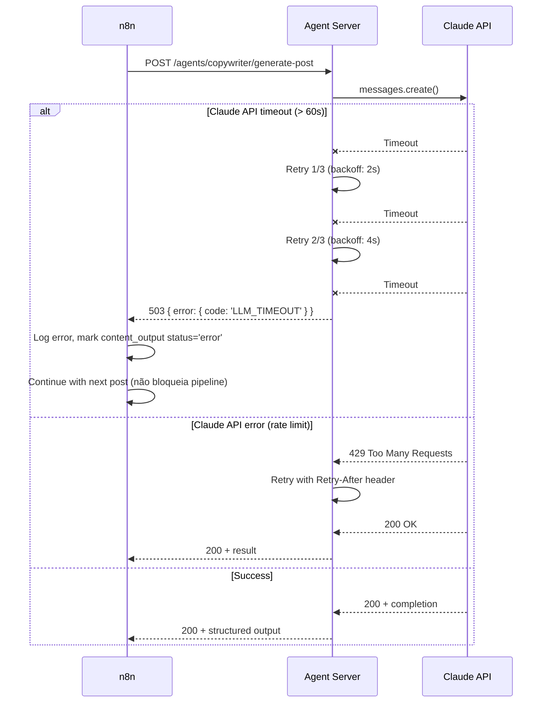

# CopyZen Fullstack Architecture Document

> **Status:** DRAFT
> **Versão:** 0.1
> **Autor:** Aria (Architect Agent)
> **Input:** PRD CopyZen v0.2 (docs/prd/copyzen-prd-v1.md)
> **Última atualização:** 2026-03-14

---

## Change Log

| Date | Version | Description | Author |
|------|---------|-------------|--------|
| 2026-03-14 | 0.1 | Initial architecture from PRD v0.2 | Aria (Architect) |
| 2026-03-14 | 0.2 | Brand Intelligence: tabela, API endpoint, workflow, Apify/Firecrawl integration (FR-27/28/29) | Aria (Architect) |

---

## 1. Introduction

Este documento define a arquitetura fullstack completa da plataforma CopyZen — uma agência de marketing digital OPB (One-Person Business) que transforma briefings de clientes em entregas de marketing completas (posts, landing pages, sales pages) via agentes de IA orquestrados por n8n.

**Greenfield project** — sem starter template. A arquitetura é custom, combinando:
- **Astro SSG** para geração de páginas estáticas (zero JS runtime)
- **n8n** como orquestrador central de workflows (já rodando na KVM4)
- **Express.js** como agent server leve expondo agentes via HTTP
- **Claude API** como LLM primário para os 3 agentes (CMO, Designer, Copywriter)
- **Supabase Cloud** para dados multi-tenant com RLS
- **Docker Swarm** + Traefik + nginx:alpine na KVM4 para hosting

Esta arquitetura NÃO é um app web tradicional (SPA/SSR). É um **pipeline de geração de conteúdo com output estático**, onde a inteligência reside nos agentes de IA e a orquestração no n8n.

---

## 2. High Level Architecture

### 2.1 Technical Summary

CopyZen adota uma arquitetura **pipeline-driven** onde n8n orquestra fluxos de trabalho que conectam agentes de IA (via agent server Express.js), serviços externos (GoHighLevel, Evolution API, APIs de imagem), e armazenamento (Supabase Cloud). O output final são sites estáticos gerados pelo Astro, servidos por nginx:alpine no Docker Swarm (CopyZen) ou Vercel (clientes). A separação é clara: n8n coordena, agentes produzem conteúdo, Astro renderiza, nginx serve. Não há API REST pública — a comunicação é interna entre n8n e o agent server via rede Docker (AZ_Net).

### 2.2 Platform and Infrastructure

**Plataforma primária:** KVM4 Hostinger (self-hosted Docker Swarm)

| Serviço | Plataforma | Justificativa |
|---------|-----------|---------------|
| Orquestração (n8n) | KVM4 Docker Swarm | Já rodando, queue mode, 3 CPU / 3 GB alocados |
| Agent Server | KVM4 Docker Swarm | Proximidade com n8n, mesma rede AZ_Net |
| Web Server (CopyZen) | KVM4 nginx:alpine | Infra existente, Traefik SSL, zero custo adicional |
| Web Server (clientes) | Vercel | CDN global, preview URLs, SSL auto, free tier |
| Database | Supabase Cloud | RLS nativo, Storage, API REST auto-gerada, free→$25/mês |
| CRM / Surveys | GoHighLevel Cloud | Já ativo, survey inicial pronto |
| WhatsApp | KVM4 Evolution API | Já rodando no Swarm |
| LLM | Claude API (Anthropic) | Qualidade PT-BR, abstraído para fallback futuro |
| Image Gen | Nano Banana / Kling AI | APIs externas, chamadas via n8n |

**Recursos KVM4:** 4 CPU, 16 GB RAM, 200 GB disco, IP 31.97.26.21, Debian 11

**Alocação estimada de recursos:**

| Serviço | CPU | RAM | Notas |
|---------|-----|-----|-------|
| n8n (editor+webhook+worker) | 3.0 | 3 GB | Já alocado |
| PostgreSQL (n8n) | 0.25 | 512 MB | Já rodando |
| Redis (n8n queue) | 0.1 | 256 MB | Já rodando |
| Evolution API | 0.25 | 512 MB | Já rodando |
| Ollama | variável | 2-4 GB | Sob demanda |
| **CopyZen Agent Server** | **0.5** | **512 MB** | Novo |
| **CopyZen nginx** | **0.1** | **128 MB** | Novo |
| **Headroom** | ~0.3 | ~1-5 GB | Depende do Ollama |

### 2.3 Repository Structure

**Monorepo com npm workspaces** — operado por 1 pessoa + IA, sem necessidade de polyrepo.

```
copyzen/
├── packages/
│   ├── core/              # Tipos compartilhados, brand config, utils
│   ├── funwheel/          # Astro project — FunWheel A-R-T pages
│   ├── sales-page/        # Astro project — Sales pages
│   ├── agents/            # Agent server (Express.js + Claude API)
│   └── integrations/      # Clients: GHL, Evolution, Supabase, Google Drive, Image Gen
├── infra/
│   └── stacks/            # Docker Swarm compose files para Portainer
├── supabase/
│   └── migrations/        # SQL migrations versionadas
├── .github/
│   └── workflows/         # GitHub Actions (build + rsync)
├── docs/                  # PRD, architecture, stories
├── tests/                 # Integration tests cross-package
├── .env.example
├── package.json           # Root workspace config
├── tsconfig.json          # Base TypeScript config
└── vitest.config.ts       # Root test config
```

**Monorepo tool:** npm workspaces nativo (sem Turborepo/Nx — overhead desnecessário para 1 pessoa).

### 2.4 High Level Architecture Diagram



### 2.5 Architectural Patterns

- **Pipeline Architecture:** Fluxo linear briefing → análise → geração → output → deploy. Cada stage tem input/output definido, orquestrado por n8n workflows. — _Rationale:_ O negócio é inerentemente um pipeline de produção. n8n torna isso visual e debugável.

- **Static Site Generation (Jamstack):** Astro gera HTML estático em build time. Zero JS runtime no cliente (exceto islands para formulários). — _Rationale:_ Páginas de marketing não precisam de interatividade além de formulários. SSG garante Lighthouse > 90 e FCP < 2s (NFR-01).

- **Agent-as-a-Service:** Cada agente (CMO, Copywriter, Designer) é exposto como endpoint HTTP no agent server, chamável por n8n ou diretamente. — _Rationale:_ Desacopla lógica de agentes da orquestração. Permite testar agentes isoladamente e escalar independentemente.

- **Multi-tenant via RLS:** Supabase Row Level Security isola dados por `client_id`. Service role key para operações internas, anon key para operações scoped. — _Rationale:_ Isolamento em nível de banco sem lógica de app. Impossível vazar dados entre clientes (NFR-05).

- **Provider Abstraction:** Interface `LLMProvider` abstrai Claude API, permitindo fallback para Ollama ou outro provider. Mesma pattern para `ImageGenerator`. — _Rationale:_ Reduz vendor lock-in (NFR-10). Ollama já está na KVM4 como fallback para tarefas menos críticas.

- **Event-Driven Orchestration:** n8n workflows respondem a webhooks (GoHighLevel, Evolution API) e executam pipelines assíncronos. — _Rationale:_ Desacoplamento natural. O survey do GoHighLevel não precisa saber que o CMO vai analisar — o n8n conecta.

- **Immutable Deploy:** GitHub Actions builda → rsync transfere → nginx serve. Sem build no servidor. Stacks gerenciados via Portainer UI. — _Rationale:_ Deploy previsível e reprodutível. Portainer dá controle visual (NFR-15).

---

## 3. Tech Stack

| Category | Technology | Version | Purpose | Rationale |
|----------|-----------|---------|---------|-----------|
| Frontend Language | TypeScript | 5.x | Type safety across all packages | Compartilhar interfaces entre packages/core e todos os consumidores |
| Frontend Framework | Astro | 5.x | SSG para landing pages e sales pages | Zero JS por default, melhor Lighthouse, ideal para páginas estáticas de marketing |
| CSS Framework | Tailwind CSS | 4.x | Utility-first styling com theming por brand config | Rápido para prototipação, purge CSS gera bundles mínimos, suporte nativo Astro |
| UI Components | Astro Components | — | Components nativos .astro + islands | Sem React runtime. Islands architecture para formulários interativos (Preact) |
| State Management | N/A | — | Páginas estáticas, sem client-side state | SSG elimina necessidade de state management. Forms usam submit direto para GHL |
| Backend Language | TypeScript / Node.js | 20 LTS | Agent server e scripts de integração | Ecossistema compartilhado com frontend, Anthropic SDK nativo |
| Backend Framework | Express.js | 5.x | Agent server HTTP — endpoints leves | Mínimo overhead, rápido para expor agentes como endpoints REST internos |
| Orchestration | n8n | latest (self-hosted) | Orquestrador central de workflows | Já rodando na KVM4, visual debugging, queue mode para paralelismo |
| API Style | REST (interno) | — | Comunicação n8n ↔ agent server | Simples, HTTP Request nodes nativos do n8n. Sem necessidade de GraphQL/tRPC |
| LLM Provider | Claude API (Anthropic) | claude-sonnet-4-6 | Agentes CMO, Copywriter, Designer | Melhor qualidade PT-BR, tool use, custos previsíveis. Abstraído via LLMProvider |
| Database | Supabase (PostgreSQL) | 15+ | Dados multi-tenant com RLS | RLS nativo, Storage, API REST auto-gerada, free tier generoso |
| Cache | Redis (existente) | 7.x | Cache de brand configs, rate limiting | Já rodando na KVM4 para n8n queue. Reusar para cache de agent server |
| File Storage | Supabase Storage | — | Logos, imagens de referência, PDFs gerados | Integrado com RLS do Supabase, URLs públicas para assets |
| Content Delivery | Google Drive API | v3 | Entrega de posts ao cliente | Plataforma familiar para clientes, compartilhamento nativo |
| Image Generation | Nano Banana / Kling AI | — | Geração de imagens para posts e páginas | APIs de imagem com style control, chamadas via n8n |
| CRM | GoHighLevel API | — | Surveys, leads, automações, comunidade VIP | Já ativo, survey inicial pronto |
| WhatsApp | Evolution API | latest | Canal de entrada alternativo | Já rodando no Swarm |
| Authentication | Supabase Auth + API Keys | — | Service role para ops internas, API key para agent server | Sem auth de usuário final no MVP — operador único. RLS via service role |
| Testing | Vitest | 3.x | Unit + integration tests | Alinhado com Astro ecosystem, rápido, ESM nativo |
| E2E Testing | Lighthouse CI | — | Performance audit automatizado no CI | Proxy de qualidade para páginas estáticas. E2E completo é over-engineering para 1 pessoa |
| Build Tool | Astro CLI | 5.x | Build SSG | `astro build` → `dist/` — direto para nginx |
| Bundler | Vite (via Astro) | 6.x | Dev server + bundling | Integrado no Astro, HMR rápido |
| CI/CD | GitHub Actions | — | Build → lint → test → rsync para KVM4 | Free tier, integração nativa GitHub, rsync para deploy estático |
| Reverse Proxy | Traefik | 3.x | Routing, SSL, load balancing no Swarm | Já configurado na KVM4, Let's Encrypt auto, labels-based |
| Web Server | nginx:alpine | latest | Serve arquivos estáticos no Swarm | Leve (< 5 MB), config simples, volumes para `/srv/sites/` |
| Container Mgmt | Portainer | latest | Deploy e monitoramento de stacks Docker | UI visual para gestão de stacks (NFR-15) |
| Monitoring | n8n execution logs + Supabase | — | Tracking de execuções e custos | `agent_execution_log` e `llm_usage_log` no Supabase. Sem Datadog/Grafana no MVP |
| Logging | console + Supabase tables | — | Logs estruturados | Agent server loga para console (Docker logs) + tabelas Supabase para audit trail |

---

## 4. Data Models

### 4.1 Entity Relationship Overview



### 4.2 Core Entities

#### Client

```typescript
interface Client {
  id: string;           // uuid
  name: string;
  email: string;
  phone: string;
  business_type: string;
  status: 'active' | 'inactive' | 'onboarding';
  created_at: string;   // ISO 8601
  updated_at: string;
}
```

#### BrandConfig

```typescript
interface BrandConfig {
  id: string;
  client_id: string;    // FK → clients
  primary_color: string; // hex
  secondary_color: string;
  accent_color: string;
  background_color: string;
  text_color: string;
  heading_font: string;
  body_font: string;
  tone_of_voice: 'formal' | 'casual' | 'technical';
  custom_guidelines: string | null;
  logo_url: string | null;
  slogan: string | null;
  keywords: string[];
  reference_images: string[];  // URLs
}
```

#### BrandIntelligence

```typescript
interface BrandIntelligence {
  id: string;
  client_id: string;
  source_url: string;
  source_type: 'website' | 'instagram' | 'facebook' | 'linkedin' | 'landing_page' | 'reference';
  colors_detected: Array<{ hex: string; percentage: number; role?: string }>;
  fonts_detected: { heading?: string; body?: string };
  tone_detected: 'formal' | 'casual' | 'technical' | null;
  keywords_extracted: string[];
  screenshot_url: string | null;
  content_structure: Record<string, unknown>;
  confidence_scores: Record<string, number>;  // 0-1 per field
  raw_data: Record<string, unknown>;
  status: 'pending' | 'scraping' | 'analyzing' | 'complete' | 'failed';
  created_at: string;
}
```

**Relationships:**
- Belongs to `Client` (many-to-one: um cliente pode ter múltiplos assets analisados)
- Consumed by `BrandConfigLoader` para enriquecer guardrails dos agentes

---

#### Briefing

```typescript
interface Briefing {
  id: string;
  client_id: string | null;  // atribuído após criação do client
  raw_data: Record<string, unknown>;  // payload do GoHighLevel
  source: 'ghl_survey' | 'whatsapp';
  status: 'received' | 'processing' | 'analyzed' | 'approved' | 'needs_info';
  created_at: string;
}
```

#### Proposal

```typescript
interface Proposal {
  id: string;
  briefing_id: string;
  client_id: string;
  package: 'ia' | 'art' | 'e' | 'combo_leads' | 'combo_cash';
  reasoning: string;
  timeline: string;
  cost_range: string;
  status: 'draft' | 'sent' | 'approved' | 'rejected';
  created_at: string;
}
```

#### ProjectPlan

```typescript
interface ProjectPlan {
  id: string;
  briefing_id: string;
  client_id: string;
  package: string;
  systems: SystemPlan[];  // timeline e tasks por sistema
  status: 'draft' | 'active' | 'completed';
  created_at: string;
}

interface SystemPlan {
  system: 'content' | 'funwheel' | 'sales_page';
  tasks: string[];
  estimated_days: number;
}
```

#### ContentOutput

```typescript
interface ContentOutput {
  id: string;
  project_plan_id: string;
  post_index: number;
  type: 'carousel' | 'image';
  mode: 'inception' | 'atracao_fatal';
  copy: {
    headline: string;
    body: string;
    cta: string;
    hashtags: string[];
    slides?: Array<{ text: string; layout_hint: string }>;
  };
  image_prompt: string;
  image_url: string | null;
  status: 'generating' | 'review' | 'approved' | 'delivered';
  created_at: string;
}
```

#### Lead

```typescript
interface Lead {
  id: string;
  client_id: string;
  funwheel_id: string | null;
  name: string;
  email: string | null;
  phone: string | null;
  source_page: 'apresentacao' | 'retencao' | 'transformacao' | 'sales_page';
  referral_code: string;  // 6 chars alphanumeric, gerado na captura
  referral_count: number;
  vip_access: boolean;
  created_at: string;
}
```

#### Referral

```typescript
interface Referral {
  id: string;
  referrer_lead_id: string;  // FK → leads
  referred_lead_id: string;  // FK → leads
  created_at: string;
}
```

#### Delivery

```typescript
interface Delivery {
  id: string;
  project_plan_id: string;
  client_id: string;
  drive_folder_url: string;
  files_count: number;
  delivered_at: string;
}
```

#### AgentExecutionLog

```typescript
interface AgentExecutionLog {
  id: string;
  agent: 'cmo' | 'copywriter' | 'designer';
  action: string;
  client_id: string | null;
  input_hash: string;
  output_hash: string;
  tokens_used: number;
  latency_ms: number;
  cost_estimate: number;  // USD
  model: string;
  timestamp: string;
}
```

#### LLMUsageLog

```typescript
interface LLMUsageLog {
  id: string;
  provider: string;
  model: string;
  input_tokens: number;
  output_tokens: number;
  total_cost: number;
  timestamp: string;
}
```

---

## 5. API Specification

### 5.1 Agent Server REST API (Internal Only)

O agent server é **interno** — acessível apenas na rede Docker AZ_Net pelo n8n. Sem exposição pública.

**Base URL:** `http://copyzen-agents:3001` (DNS interno Docker Swarm)

```yaml
openapi: 3.0.0
info:
  title: CopyZen Agent Server
  version: 1.0.0
  description: Internal API for AI agent execution. Called by n8n workflows only.

servers:
  - url: http://copyzen-agents:3001
    description: Docker Swarm internal (AZ_Net)

security:
  - ApiKeyAuth: []

components:
  securitySchemes:
    ApiKeyAuth:
      type: apiKey
      in: header
      name: X-Agent-API-Key

paths:
  /health:
    get:
      summary: Health check
      responses:
        '200':
          description: Agent server and LLM provider status

  /agents/cmo/analyze-briefing:
    post:
      summary: CMO analyzes briefing and recommends package
      requestBody:
        content:
          application/json:
            schema:
              type: object
              properties:
                briefing_id: { type: string }
                briefing_data: { type: object }
                client_id: { type: string }
      responses:
        '200':
          description: Package recommendation + reasoning

  /agents/cmo/create-project-plan:
    post:
      summary: CMO creates detailed project plan
      requestBody:
        content:
          application/json:
            schema:
              type: object
              properties:
                briefing_id: { type: string }
                system_surveys: { type: array }
                brand_config: { type: object }

  /agents/cmo/review-output:
    post:
      summary: CMO reviews output from other agents
      requestBody:
        content:
          application/json:
            schema:
              type: object
              properties:
                output: { type: object }
                brand_config: { type: object }
                briefing: { type: object }

  /agents/cmo/analyze-brand-intel:
    post:
      summary: Analyze scraped brand data to extract colors, tone, keywords
      requestBody:
        content:
          application/json:
            schema:
              type: object
              properties:
                raw_scrape_data: { type: object }
                source_type: { type: string }
                source_url: { type: string }
      responses:
        '200':
          description: Structured brand intelligence with confidence scores

  /agents/copywriter/generate-post:
    post:
      summary: Generate social media post copy
      requestBody:
        content:
          application/json:
            schema:
              type: object
              properties:
                brief: { type: object }
                brand_config: { type: object }
                mode: { type: string, enum: [inception, atracao_fatal] }
                type: { type: string, enum: [carousel, image] }

  /agents/copywriter/generate-landing-page:
    post:
      summary: Generate landing page copy
      requestBody:
        content:
          application/json:
            schema:
              type: object
              properties:
                brief: { type: object }
                brand_config: { type: object }
                page_type: { type: string, enum: [apresentacao, retencao, transformacao] }

  /agents/copywriter/generate-sales-page:
    post:
      summary: Generate sales page copy (all sections)

  /agents/copywriter/revise:
    post:
      summary: Revise copy based on feedback

  /agents/designer/generate-image-prompt:
    post:
      summary: Generate optimized prompt for image API

  /agents/designer/apply-brand-theme:
    post:
      summary: Generate CSS/Tailwind theme from brand config

  /agents/designer/select-template:
    post:
      summary: Select appropriate page template for brand
```

### 5.2 n8n Webhook Endpoints (External-facing)

| Endpoint | Source | Purpose |
|----------|--------|---------|
| `POST /webhook/briefing-intake` | GoHighLevel Survey | Receber briefing inicial |
| `POST /webhook/proposal-response` | GoHighLevel / Email link | Receber aprovação/rejeição da proposta |
| `POST /webhook/system-survey/{system}` | GoHighLevel Surveys | Receber surveys específicos por sistema |
| `POST /webhook/whatsapp-incoming` | Evolution API | Receber mensagens WhatsApp |

---

## 6. Components

### 6.1 Component List

#### packages/core — Shared Types & Utils

**Responsibility:** Tipos TypeScript compartilhados, brand config types, utility functions, constantes.

**Key Interfaces:** Todas as interfaces de Data Models (seção 4), `BrandGuardrails`, `LLMProvider`

**Dependencies:** Nenhuma (leaf package)

**Technology:** TypeScript only, zero dependencies externas

---

#### packages/agents — Agent Server

**Responsibility:** Expor agentes CMO, Copywriter e Designer como endpoints HTTP. Gerenciar chamadas à Claude API, brand guardrails, logging de execuções.

**Key Interfaces:**
- `POST /agents/{agent}/{action}` — API REST interna
- `GET /health` — Status check
- `LLMProvider` interface para abstração de provider
- `BrandGuardrails` para validação de compliance

**Dependencies:** `@copyzen/core`, `@anthropic-ai/sdk`, `express`

**Technology:** Express.js 5, TypeScript, Anthropic SDK

---

#### packages/funwheel — FunWheel Pages (Astro SSG)

**Responsibility:** Templates Astro para as 3 páginas FunWheel (Apresentação, Retenção, Transformação) + Thank You. Build-time theming via brand config.

**Key Interfaces:**
- `astro build` → `dist/` (static HTML/CSS)
- `BrandConfig` → Tailwind theme generation
- `CopyContent` → JSON com copy gerado pelos agentes

**Dependencies:** `@copyzen/core`, `astro`, `tailwindcss`

**Technology:** Astro 5, Tailwind CSS 4, Preact (islands para formulários)

---

#### packages/sales-page — Sales Page (Astro SSG)

**Responsibility:** Template Astro para página de vendas long-form com seções modulares. Mesma arquitetura do FunWheel.

**Key Interfaces:** Idênticas ao FunWheel

**Dependencies:** `@copyzen/core`, `astro`, `tailwindcss`

---

#### packages/integrations — External Service Clients

**Responsibility:** Clients para todos os serviços externos. Cada integração é um módulo isolado.

**Módulos:**
- `supabase/` — Supabase client (queries, storage, RLS-aware)
- `gohighlevel/` — GHL API client (contacts, tags, automations)
- `google-drive/` — Google Drive API (upload, folders, sharing)
- `evolution-api/` — Evolution API client (send/receive WhatsApp)
- `image-generation/` — Nano Banana + Kling AI (abstracted via `ImageGenerator` interface)
- `pdf-generator/` — Geração de PDF do lead magnet (puppeteer ou jsPDF)
- `brand-scraping/` — Apify + Firecrawl para brand intelligence (abstracted via `BrandScrapingProvider` interface)

**Dependencies:** `@copyzen/core`, SDKs específicos de cada serviço

---

#### infra/stacks — Docker Swarm Compose Files

**Responsibility:** Definições de stack para deploy via Portainer UI.

**Arquivos:**
- `copyzen-agents.yml` — Agent server (Express.js)
- `copyzen-funwheel.yml` — nginx para FunWheel (fw.copyzen.com.br)
- `copyzen-sales.yml` — nginx para Sales Page

---

### 6.2 Component Interaction Diagram



---

## 7. External APIs

### 7.1 Claude API (Anthropic)

- **Purpose:** LLM primário para todos os agentes (CMO, Copywriter, Designer)
- **Documentation:** https://docs.anthropic.com/
- **Base URL:** `https://api.anthropic.com/v1`
- **Authentication:** API key via header `x-api-key`
- **Rate Limits:** Tier 1: 50 RPM, 40K TPM (ajustar conforme tier)
- **Key Endpoints:** `POST /messages` — primary completion endpoint
- **Integration Notes:** Usar Anthropic SDK (@anthropic-ai/sdk). Modelo default: `claude-sonnet-4-6` para custo-benefício. Retry com backoff exponencial (3 tentativas). Log tokens/custo por chamada.

### 7.2 GoHighLevel API

- **Purpose:** CRM, surveys, automações de email, comunidade VIP
- **Documentation:** https://highlevel.stoplight.io/docs/integrations/
- **Authentication:** API key (location-level)
- **Rate Limits:** 100 requests/10 seconds
- **Key Endpoints:**
  - `POST /contacts` — criar/atualizar contato
  - `PUT /contacts/{id}/tags` — adicionar tags
  - `POST /contacts/{id}/workflow/{workflowId}` — disparar automação
- **Integration Notes:** Webhooks outgoing configurados no GHL para n8n endpoints. API key via env var `GHL_API_KEY`.

### 7.3 Evolution API (WhatsApp)

- **Purpose:** Envio/recebimento de mensagens WhatsApp
- **Base URL:** `http://evolution-api:8080` (interno Docker Swarm)
- **Authentication:** API key via header
- **Key Endpoints:**
  - `POST /message/sendText/{instance}` — enviar mensagem
  - Webhook incoming para n8n
- **Integration Notes:** Já rodando na KVM4. Mesmo rede AZ_Net. Sem rate limit interno.

### 7.4 Google Drive API

- **Purpose:** Upload de conteúdo gerado, criação de pastas compartilhadas
- **Documentation:** https://developers.google.com/drive/api/v3
- **Authentication:** Service Account (OAuth2 JWT)
- **Rate Limits:** 20,000 queries/100 seconds
- **Key Endpoints:**
  - `POST /files` — upload
  - `POST /files/{id}/permissions` — compartilhar
  - `POST /files` (metadata only) — criar pasta
- **Integration Notes:** Service account credentials via env var (JSON). Nunca usar credenciais pessoais.

### 7.5 Apify / Firecrawl (Brand Intelligence Scraping)

- **Purpose:** Extrair automaticamente informações de marca de ativos digitais do cliente (sites, redes sociais, landing pages) ou URLs de referência
- **Documentation:** Apify: https://docs.apify.com/ | Firecrawl: https://docs.firecrawl.dev/
- **Authentication:** API key por provider
- **Key Use Cases:**
  - `Web Scraper Actor` (Apify) — extrair HTML, CSS, imagens de sites
  - `Instagram Scraper` (Apify) — extrair posts, bio, estilo visual de perfis
  - `Firecrawl /scrape` — extrair conteúdo markdown + metadata de páginas
- **Rate Limits:** Apify: depende do plano (free: 30 min compute/mês). Firecrawl: 500 pages/mês (free).
- **Integration Notes:** Chamadas via n8n HTTP Request nodes ou Apify Actor nodes nativos. Output processado por Claude (via agent server) para inferir tom de voz, classificar cores, e extrair keywords. Screenshots via puppeteer ou Apify Screenshot Actor. Abstrair via interface `BrandScrapingProvider` para flexibilidade entre Apify e Firecrawl.

### 7.6 Nano Banana / Kling AI (Image Generation)

- **Purpose:** Geração de imagens para posts e páginas
- **Authentication:** API keys por provider
- **Integration Notes:** Abstraído via interface `ImageGenerator`. Fallback: se Nano Banana falhar, tenta Kling AI. Custo por imagem rastreado em `llm_usage_log`.

### 7.6 Supabase (Cloud)

- **Purpose:** Banco de dados, storage, RLS
- **Base URL:** `https://{project-ref}.supabase.co`
- **Authentication:** Service role key (internal), anon key (scoped)
- **Key Endpoints:** REST API auto-gerada, Storage API
- **Integration Notes:** Supabase JS client (`@supabase/supabase-js`). RLS policies enforced em todas as tabelas.

---

## 8. Core Workflows

### 8.1 Briefing → Project Plan (Sistema 0)



### 8.2 Brand Intelligence Scraping (FR-27/28/29)



### 8.3 Content Generation (Sistema 1)



### 8.4 FunWheel Page Generation (Sistema 2)



### 8.5 Lead Capture & Referral Flow



---

## 9. Database Schema

> **Nota:** Schema conceitual. Detalhamento DDL (indexes, constraints, triggers) delegado ao @data-engineer.

```sql
-- Core entities
CREATE TABLE clients (
    id UUID PRIMARY KEY DEFAULT gen_random_uuid(),
    name TEXT NOT NULL,
    email TEXT NOT NULL,
    phone TEXT,
    business_type TEXT,
    status TEXT NOT NULL DEFAULT 'onboarding'
        CHECK (status IN ('active', 'inactive', 'onboarding')),
    created_at TIMESTAMPTZ DEFAULT now(),
    updated_at TIMESTAMPTZ DEFAULT now()
);

CREATE TABLE brand_configs (
    id UUID PRIMARY KEY DEFAULT gen_random_uuid(),
    client_id UUID NOT NULL REFERENCES clients(id) ON DELETE CASCADE,
    primary_color TEXT NOT NULL,
    secondary_color TEXT,
    accent_color TEXT,
    background_color TEXT DEFAULT '#ffffff',
    text_color TEXT DEFAULT '#1a1a1a',
    heading_font TEXT NOT NULL,
    body_font TEXT NOT NULL,
    tone_of_voice TEXT NOT NULL DEFAULT 'casual'
        CHECK (tone_of_voice IN ('formal', 'casual', 'technical')),
    custom_guidelines TEXT,
    logo_url TEXT,
    slogan TEXT,
    keywords TEXT[] DEFAULT '{}',
    reference_images TEXT[] DEFAULT '{}',
    UNIQUE (client_id)
);

-- Brand intelligence (scraped from digital assets)
CREATE TABLE brand_intelligence (
    id UUID PRIMARY KEY DEFAULT gen_random_uuid(),
    client_id UUID NOT NULL REFERENCES clients(id) ON DELETE CASCADE,
    source_url TEXT NOT NULL,
    source_type TEXT NOT NULL
        CHECK (source_type IN ('website', 'instagram', 'facebook', 'linkedin',
                               'landing_page', 'reference')),
    colors_detected JSONB DEFAULT '[]',       -- array of { hex, percentage, role }
    fonts_detected JSONB DEFAULT '{}',        -- { heading: string, body: string }
    tone_detected TEXT,                       -- formal / casual / technical
    keywords_extracted TEXT[] DEFAULT '{}',
    screenshot_url TEXT,
    content_structure JSONB DEFAULT '{}',     -- nav items, sections, CTAs found
    confidence_scores JSONB DEFAULT '{}',     -- { colors: 0.9, tone: 0.7, ... }
    raw_data JSONB DEFAULT '{}',
    status TEXT NOT NULL DEFAULT 'pending'
        CHECK (status IN ('pending', 'scraping', 'analyzing', 'complete', 'failed')),
    created_at TIMESTAMPTZ DEFAULT now()
);

-- Pipeline entities
CREATE TABLE briefings (
    id UUID PRIMARY KEY DEFAULT gen_random_uuid(),
    client_id UUID REFERENCES clients(id),
    raw_data JSONB NOT NULL,
    source TEXT NOT NULL CHECK (source IN ('ghl_survey', 'whatsapp')),
    status TEXT NOT NULL DEFAULT 'received'
        CHECK (status IN ('received', 'processing', 'analyzed', 'approved', 'needs_info')),
    created_at TIMESTAMPTZ DEFAULT now()
);

CREATE TABLE proposals (
    id UUID PRIMARY KEY DEFAULT gen_random_uuid(),
    briefing_id UUID NOT NULL REFERENCES briefings(id),
    client_id UUID NOT NULL REFERENCES clients(id),
    package TEXT NOT NULL
        CHECK (package IN ('ia', 'art', 'e', 'combo_leads', 'combo_cash')),
    reasoning TEXT NOT NULL,
    timeline TEXT,
    cost_range TEXT,
    status TEXT NOT NULL DEFAULT 'draft'
        CHECK (status IN ('draft', 'sent', 'approved', 'rejected')),
    created_at TIMESTAMPTZ DEFAULT now()
);

CREATE TABLE system_surveys (
    id UUID PRIMARY KEY DEFAULT gen_random_uuid(),
    briefing_id UUID NOT NULL REFERENCES briefings(id),
    system TEXT NOT NULL
        CHECK (system IN ('content', 'funwheel', 'sales_page')),
    responses JSONB NOT NULL,
    status TEXT NOT NULL DEFAULT 'received',
    created_at TIMESTAMPTZ DEFAULT now()
);

CREATE TABLE project_plans (
    id UUID PRIMARY KEY DEFAULT gen_random_uuid(),
    briefing_id UUID NOT NULL REFERENCES briefings(id),
    client_id UUID NOT NULL REFERENCES clients(id),
    package TEXT NOT NULL,
    systems JSONB NOT NULL,  -- array of SystemPlan
    status TEXT NOT NULL DEFAULT 'draft'
        CHECK (status IN ('draft', 'active', 'completed')),
    created_at TIMESTAMPTZ DEFAULT now()
);

-- Content entities
CREATE TABLE content_outputs (
    id UUID PRIMARY KEY DEFAULT gen_random_uuid(),
    project_plan_id UUID NOT NULL REFERENCES project_plans(id),
    post_index INTEGER NOT NULL,
    type TEXT NOT NULL CHECK (type IN ('carousel', 'image')),
    mode TEXT NOT NULL CHECK (mode IN ('inception', 'atracao_fatal')),
    copy JSONB NOT NULL,
    image_prompt TEXT,
    image_url TEXT,
    status TEXT NOT NULL DEFAULT 'generating'
        CHECK (status IN ('generating', 'review', 'approved', 'delivered')),
    created_at TIMESTAMPTZ DEFAULT now()
);

CREATE TABLE deliveries (
    id UUID PRIMARY KEY DEFAULT gen_random_uuid(),
    project_plan_id UUID NOT NULL REFERENCES project_plans(id),
    client_id UUID NOT NULL REFERENCES clients(id),
    drive_folder_url TEXT NOT NULL,
    files_count INTEGER NOT NULL,
    delivered_at TIMESTAMPTZ DEFAULT now()
);

-- Lead entities
CREATE TABLE leads (
    id UUID PRIMARY KEY DEFAULT gen_random_uuid(),
    client_id UUID NOT NULL REFERENCES clients(id),
    funwheel_id TEXT,
    name TEXT NOT NULL,
    email TEXT,
    phone TEXT,
    source_page TEXT NOT NULL
        CHECK (source_page IN ('apresentacao', 'retencao', 'transformacao', 'sales_page')),
    referral_code TEXT NOT NULL UNIQUE,
    referral_count INTEGER DEFAULT 0,
    vip_access BOOLEAN DEFAULT false,
    created_at TIMESTAMPTZ DEFAULT now()
);

CREATE TABLE referrals (
    id UUID PRIMARY KEY DEFAULT gen_random_uuid(),
    referrer_lead_id UUID NOT NULL REFERENCES leads(id),
    referred_lead_id UUID NOT NULL REFERENCES leads(id),
    created_at TIMESTAMPTZ DEFAULT now()
);

-- Observability entities
CREATE TABLE agent_execution_log (
    id UUID PRIMARY KEY DEFAULT gen_random_uuid(),
    agent TEXT NOT NULL CHECK (agent IN ('cmo', 'copywriter', 'designer')),
    action TEXT NOT NULL,
    client_id UUID REFERENCES clients(id),
    input_hash TEXT,
    output_hash TEXT,
    tokens_used INTEGER,
    latency_ms INTEGER,
    cost_estimate NUMERIC(10, 6),
    model TEXT,
    timestamp TIMESTAMPTZ DEFAULT now()
);

CREATE TABLE llm_usage_log (
    id UUID PRIMARY KEY DEFAULT gen_random_uuid(),
    provider TEXT NOT NULL,
    model TEXT NOT NULL,
    input_tokens INTEGER NOT NULL,
    output_tokens INTEGER NOT NULL,
    total_cost NUMERIC(10, 6) NOT NULL,
    timestamp TIMESTAMPTZ DEFAULT now()
);

CREATE TABLE whatsapp_interactions (
    id UUID PRIMARY KEY DEFAULT gen_random_uuid(),
    phone TEXT NOT NULL,
    message_type TEXT NOT NULL,
    direction TEXT NOT NULL CHECK (direction IN ('incoming', 'outgoing')),
    timestamp TIMESTAMPTZ DEFAULT now()
);

-- RLS Policies (conceptual — detailed implementation delegated to @data-engineer)
-- Every table with client_id gets: SELECT/INSERT/UPDATE/DELETE WHERE client_id = auth.uid()
-- agent_execution_log and llm_usage_log: service_role only
-- leads: scoped by client_id (the CopyZen client who owns the funwheel)
```

---

## 10. Frontend Architecture

### 10.1 Component Architecture

CopyZen não é um SPA. São **páginas estáticas geradas** com Astro. A "frontend architecture" é a organização de templates e componentes Astro.

```
packages/funwheel/src/
├── layouts/
│   └── BaseLayout.astro        # HTML base, meta tags, brand theme injection
├── pages/
│   ├── apresentacao.astro      # Página A (narrativa de transformação)
│   ├── retencao.astro          # Página R (captura de lead)
│   ├── transformacao.astro     # Página T (indicação + VIP)
│   └── obrigado.astro          # Thank you page
├── components/
│   ├── Hero.astro              # Hero section com headline + CTA
│   ├── Section.astro           # Seção genérica com título + conteúdo
│   ├── CTA.astro               # Call-to-action button (brand-aware)
│   ├── LeadForm.astro          # Formulário de captura (Preact island)
│   ├── ShareButtons.astro      # Botões de compartilhamento (WhatsApp, link)
│   ├── ReferralCounter.astro   # Contador de indicações (Preact island)
│   ├── FAQ.astro               # Accordion de FAQ
│   ├── SocialProof.astro       # Depoimentos / resultados
│   └── Footer.astro            # Footer com branding
├── styles/
│   ├── global.css              # CSS base + Tailwind imports
│   └── brand-theme.css         # CSS custom properties gerado em build time
└── lib/
    ├── supabase.ts             # Client-side Supabase (anon key, scoped)
    ├── ghl.ts                  # Client-side GHL form submission
    └── referral.ts             # Referral code handling
```

### 10.2 State Management

**N/A para SSG.** Não há client-side state global. Os únicos estados client-side são:

1. **Form state** — gerido localmente pelo Preact island `LeadForm`
2. **Referral tracking** — `?ref=` query param lido e enviado com form submission
3. **Referral counter** — Preact island que faz fetch ao Supabase para mostrar contagem

### 10.3 Routing Architecture

Astro file-based routing. Cada `.astro` em `pages/` = uma rota.

```
/                       → apresentacao.astro (ou redirect)
/apresentacao           → Página de Apresentação
/retencao               → Página de Retenção (lead capture)
/transformacao          → Página de Transformação (referral)
/obrigado               → Thank you page
```

Não há rotas protegidas no sentido tradicional. A "proteção" do Transformação é condicional no client-side (verifica referral_count via Supabase).

### 10.4 Frontend Services Layer

```typescript
// packages/funwheel/src/lib/supabase.ts
import { createClient } from '@supabase/supabase-js';

const supabase = createClient(
  import.meta.env.PUBLIC_SUPABASE_URL,
  import.meta.env.PUBLIC_SUPABASE_ANON_KEY
);

export async function createLead(data: {
  client_id: string;
  name: string;
  email?: string;
  phone?: string;
  source_page: string;
  referral_code: string;
  referred_by?: string;
}) {
  const { data: lead, error } = await supabase
    .from('leads')
    .insert(data)
    .select()
    .single();

  if (error) throw error;
  return lead;
}

export async function getReferralCount(leadId: string): Promise<number> {
  const { count } = await supabase
    .from('referrals')
    .select('*', { count: 'exact', head: true })
    .eq('referrer_lead_id', leadId);

  return count ?? 0;
}
```

---

## 11. Backend Architecture

### 11.1 Agent Server Architecture

O "backend" do CopyZen é o **Agent Server** — um Express.js leve que encapsula os 3 agentes de IA.

```
packages/agents/src/
├── server.ts                   # Express app entry point
├── routes/
│   ├── health.ts               # GET /health
│   ├── cmo.ts                  # POST /agents/cmo/*
│   ├── copywriter.ts           # POST /agents/copywriter/*
│   └── designer.ts             # POST /agents/designer/*
├── agents/
│   ├── base-agent.ts           # Abstract base class
│   ├── cmo-agent.ts            # CMO implementation
│   ├── copywriter-agent.ts     # Copywriter implementation
│   └── designer-agent.ts       # Designer implementation
├── llm/
│   ├── provider.ts             # LLMProvider interface
│   ├── claude-provider.ts      # Claude API implementation
│   └── factory.ts              # createLLMProvider factory
├── brand/
│   ├── config-loader.ts        # Load BrandConfig from Supabase (cached)
│   ├── guardrails.ts           # Generate system prompt additions
│   └── validator.ts            # Validate output brand compliance
├── middleware/
│   ├── auth.ts                 # API key validation
│   ├── logging.ts              # Request/response logging
│   └── error-handler.ts        # Centralized error handling
└── config.ts                   # Environment config
```

### 11.2 Authentication & Authorization



**Modelo de auth simplificado para MVP (operador único):**
- **Agent Server ↔ n8n:** API key compartilhada via env var (`AGENT_API_KEY`)
- **Agent Server ↔ Supabase:** Service role key (acesso total, RLS bypassed)
- **Frontend pages ↔ Supabase:** Anon key (RLS enforced, scoped por client_id)
- **Frontend pages ↔ GoHighLevel:** API call direta para form submission (no auth no client-side — GHL valida pelo location ID)

Sem login de usuário no MVP. Fernando é o único operador.

### 11.3 Database Access Pattern

```typescript
// packages/agents/src/brand/config-loader.ts
import { createClient } from '@supabase/supabase-js';

const supabase = createClient(
  process.env.SUPABASE_URL!,
  process.env.SUPABASE_SERVICE_ROLE_KEY!  // bypasses RLS
);

const cache = new Map<string, { data: BrandConfig; expiry: number }>();
const TTL = 5 * 60 * 1000; // 5 min

export async function loadBrandConfig(clientId: string): Promise<BrandConfig> {
  const cached = cache.get(clientId);
  if (cached && cached.expiry > Date.now()) return cached.data;

  const { data, error } = await supabase
    .from('brand_configs')
    .select('*')
    .eq('client_id', clientId)
    .single();

  if (error) throw new Error(`BrandConfig not found for client ${clientId}`);

  cache.set(clientId, { data, expiry: Date.now() + TTL });
  return data;
}
```

---

## 12. Unified Project Structure

```
copyzen/
├── .github/
│   └── workflows/
│       ├── deploy-kvm4.yml            # Build → lint → test → rsync to KVM4
│       └── deploy-vercel.yml          # Deploy client pages to Vercel
├── packages/
│   ├── core/                          # @copyzen/core
│   │   ├── src/
│   │   │   ├── types/                 # All TypeScript interfaces
│   │   │   │   ├── client.ts
│   │   │   │   ├── brand.ts
│   │   │   │   ├── briefing.ts
│   │   │   │   ├── content.ts
│   │   │   │   ├── lead.ts
│   │   │   │   └── index.ts          # Re-exports
│   │   │   ├── constants/
│   │   │   │   ├── packages.ts        # 5 package types
│   │   │   │   └── systems.ts
│   │   │   └── utils/
│   │   │       ├── referral-code.ts   # Generate 6-char codes
│   │   │       └── validators.ts
│   │   ├── package.json
│   │   └── tsconfig.json
│   ├── agents/                        # @copyzen/agents
│   │   ├── src/
│   │   │   ├── server.ts             # Express entry point
│   │   │   ├── config.ts             # Env config loader
│   │   │   ├── routes/               # HTTP route handlers
│   │   │   ├── agents/               # Agent implementations
│   │   │   ├── llm/                  # LLM abstraction layer
│   │   │   ├── brand/                # Brand config + guardrails
│   │   │   └── middleware/           # Auth, logging, errors
│   │   ├── Dockerfile                # Docker image for agent server
│   │   ├── package.json
│   │   └── tsconfig.json
│   ├── funwheel/                      # @copyzen/funwheel
│   │   ├── src/
│   │   │   ├── layouts/
│   │   │   ├── pages/
│   │   │   ├── components/
│   │   │   ├── styles/
│   │   │   └── lib/
│   │   ├── astro.config.mjs
│   │   ├── tailwind.config.mjs
│   │   ├── package.json
│   │   └── tsconfig.json
│   ├── sales-page/                    # @copyzen/sales-page
│   │   ├── src/                      # Same structure as funwheel
│   │   ├── astro.config.mjs
│   │   ├── tailwind.config.mjs
│   │   ├── package.json
│   │   └── tsconfig.json
│   └── integrations/                  # @copyzen/integrations
│       ├── src/
│       │   ├── supabase/
│       │   │   ├── client.ts
│       │   │   └── queries.ts
│       │   ├── gohighlevel/
│       │   │   └── client.ts
│       │   ├── google-drive/
│       │   │   └── client.ts
│       │   ├── evolution-api/
│       │   │   └── client.ts
│       │   ├── image-generation/
│       │   │   ├── provider.ts       # ImageGenerator interface
│       │   │   ├── nano-banana.ts
│       │   │   └── kling-ai.ts
│       │   ├── pdf-generator/
│       │   │   └── generator.ts
│       │   └── brand-scraping/
│       │       ├── provider.ts       # BrandScrapingProvider interface
│       │       ├── apify.ts          # Apify implementation
│       │       └── firecrawl.ts      # Firecrawl implementation
│       ├── package.json
│       └── tsconfig.json
├── infra/
│   └── stacks/
│       ├── copyzen-agents.yml         # Agent server Docker stack
│       ├── copyzen-funwheel.yml       # nginx for fw.copyzen.com.br
│       └── copyzen-sales.yml          # nginx for sales page
├── supabase/
│   └── migrations/
│       ├── 001_initial_schema.sql
│       └── 002_rls_policies.sql
├── tests/
│   ├── integration/
│   │   ├── agent-pipeline.test.ts     # n8n → agents → output
│   │   ├── supabase-rls.test.ts       # RLS isolation
│   │   └── ghl-webhook.test.ts        # GoHighLevel integration
│   └── setup.ts
├── docs/
│   ├── prd/
│   │   └── copyzen-prd-v1.md
│   ├── architecture/
│   │   └── copyzen-architecture.md    # This document
│   ├── infra/
│   │   ├── deploy-portainer.md
│   │   └── deploy-funwheel.md
│   └── stories/
├── .env.example
├── .gitignore
├── package.json                       # Root workspace
├── tsconfig.json                      # Base TS config
├── vitest.config.ts                   # Root test config
└── vitest.workspace.ts                # Workspace test config
```

---

## 13. Development Workflow

### 13.1 Prerequisites

```bash
# Ferramentas necessárias
node --version    # >= 20.x LTS
npm --version     # >= 10.x
git --version     # >= 2.x

# Contas necessárias
# - Supabase account (free tier)
# - Anthropic API key (Claude)
# - GoHighLevel account (já ativo)
# - Google Cloud service account (para Drive API)
# - GitHub account (para repo + Actions)
```

### 13.2 Initial Setup

```bash
# Clone e setup
git clone git@github.com:{org}/copyzen.git
cd copyzen
npm install          # Instala deps de todos os workspaces

# Configuração
cp .env.example .env
# Preencher: SUPABASE_URL, SUPABASE_SERVICE_ROLE_KEY, CLAUDE_API_KEY, etc.

# Supabase migrations (se local dev)
npx supabase db push
```

### 13.3 Development Commands

```bash
# Start agent server (packages/agents)
npm run dev -w @copyzen/agents         # Express.js com hot reload (nodemon)

# Start FunWheel dev server (packages/funwheel)
npm run dev -w @copyzen/funwheel       # Astro dev server (localhost:4321)

# Start sales page dev server
npm run dev -w @copyzen/sales-page     # Astro dev server (localhost:4322)

# Run all tests
npm test                               # Vitest across all workspaces

# Run tests for specific package
npm test -w @copyzen/agents
npm test -w @copyzen/core

# Lint
npm run lint                           # ESLint across all workspaces

# Type check
npm run typecheck                      # tsc --noEmit across all workspaces

# Build FunWheel for production
npm run build -w @copyzen/funwheel     # Output: packages/funwheel/dist/

# Build agent server Docker image
docker build -t copyzen-agents packages/agents/
```

### 13.4 Environment Variables

```bash
# === Supabase ===
SUPABASE_URL=https://{project-ref}.supabase.co
SUPABASE_ANON_KEY=eyJ...
SUPABASE_SERVICE_ROLE_KEY=eyJ...

# === Claude API ===
CLAUDE_API_KEY=sk-ant-...
CLAUDE_MODEL=claude-sonnet-4-6
LLM_PROVIDER=claude

# === Agent Server ===
AGENT_API_KEY={shared-key-for-n8n}
AGENT_PORT=3001

# === GoHighLevel ===
GHL_API_KEY={ghl-api-key}
GHL_LOCATION_ID={location-id}

# === Google Drive ===
GOOGLE_SERVICE_ACCOUNT_JSON={base64-encoded-credentials}

# === Evolution API ===
EVOLUTION_API_URL=http://evolution-api:8080
EVOLUTION_API_KEY={key}
EVOLUTION_INSTANCE={instance-name}

# === Image Generation ===
NANO_BANANA_API_KEY={key}
KLING_AI_API_KEY={key}

# === Brand Intelligence Scraping ===
APIFY_API_TOKEN={apify-token}
FIRECRAWL_API_KEY={firecrawl-key}
BRAND_SCRAPING_PROVIDER=apify  # or firecrawl

# === KVM4 Deploy (GitHub Actions secrets) ===
KVM4_HOST=31.97.26.21
KVM4_USER=deploy
KVM4_SSH_KEY={private-key}
KVM4_DEPLOY_PATH=/srv/sites

# === Astro (public — exposed to client) ===
PUBLIC_SUPABASE_URL=https://{project-ref}.supabase.co
PUBLIC_SUPABASE_ANON_KEY=eyJ...
PUBLIC_GHL_LOCATION_ID={location-id}
```

---

## 14. Deployment Architecture

### 14.1 Deployment Strategy

**Frontend (CopyZen):**
- **Platform:** KVM4 Docker Swarm → nginx:alpine
- **Build:** `astro build` → `dist/`
- **Transfer:** GitHub Actions rsync to `/srv/sites/{domain}/`
- **Serve:** nginx:alpine com Traefik SSL
- **CDN:** Sem CDN no MVP (Traefik serve direto). Cloudflare se necessário no futuro.

**Frontend (Clientes):**
- **Platform:** Vercel
- **Build:** `astro build` via Vercel
- **Deploy:** Git push trigger ou `vercel deploy`
- **CDN:** Vercel Edge Network (global)

**Agent Server:**
- **Platform:** KVM4 Docker Swarm
- **Build:** `docker build` → image local
- **Deploy:** Stack compose via Portainer UI
- **Network:** AZ_Net (internal only)

### 14.2 CI/CD Pipeline

```yaml
# .github/workflows/deploy-kvm4.yml
name: Deploy to KVM4

on:
  push:
    branches: [main]
  workflow_dispatch:

jobs:
  build-and-deploy:
    runs-on: ubuntu-latest
    steps:
      - uses: actions/checkout@v4

      - uses: actions/setup-node@v4
        with:
          node-version: 20
          cache: npm

      - run: npm ci

      - run: npm run lint
      - run: npm run typecheck
      - run: npm test

      - name: Build FunWheel
        run: npm run build -w @copyzen/funwheel
        env:
          PUBLIC_SUPABASE_URL: ${{ secrets.PUBLIC_SUPABASE_URL }}
          PUBLIC_SUPABASE_ANON_KEY: ${{ secrets.PUBLIC_SUPABASE_ANON_KEY }}

      - name: Deploy to KVM4
        uses: burnett01/rsync-deployments@7.0.1
        with:
          switches: -avz --delete
          path: packages/funwheel/dist/
          remote_path: /srv/sites/fw.copyzen.com.br/
          remote_host: ${{ secrets.KVM4_HOST }}
          remote_user: ${{ secrets.KVM4_USER }}
          remote_key: ${{ secrets.KVM4_SSH_KEY }}
```

### 14.3 Environments

| Environment | Frontend URL | Agent Server | Purpose |
|-------------|-------------|-------------|---------|
| Development | localhost:4321 | localhost:3001 | Local development |
| Production (CopyZen) | https://fw.copyzen.com.br | http://copyzen-agents:3001 (internal) | Live CopyZen |
| Production (Clientes) | https://{client}.vercel.app | Same agent server | Client preview/prod |

### 14.4 Docker Swarm Stacks

```yaml
# infra/stacks/copyzen-agents.yml
version: "3.8"
services:
  agents:
    image: copyzen-agents:latest
    environment:
      - SUPABASE_URL=${SUPABASE_URL}
      - SUPABASE_SERVICE_ROLE_KEY=${SUPABASE_SERVICE_ROLE_KEY}
      - CLAUDE_API_KEY=${CLAUDE_API_KEY}
      - CLAUDE_MODEL=${CLAUDE_MODEL}
      - AGENT_API_KEY=${AGENT_API_KEY}
      - AGENT_PORT=3001
    networks:
      - AZ_Net
    deploy:
      replicas: 1
      resources:
        limits:
          cpus: "0.5"
          memory: 512M
        reservations:
          cpus: "0.25"
          memory: 256M

networks:
  AZ_Net:
    external: true
```

```yaml
# infra/stacks/copyzen-funwheel.yml
version: "3.8"
services:
  nginx:
    image: nginx:alpine
    volumes:
      - /srv/sites/fw.copyzen.com.br:/usr/share/nginx/html:ro
    networks:
      - AZ_Net
    deploy:
      replicas: 1
      resources:
        limits:
          cpus: "0.1"
          memory: 128M
      labels:
        - "traefik.enable=true"
        - "traefik.http.routers.cz-funwheel.rule=Host(`fw.copyzen.com.br`)"
        - "traefik.http.routers.cz-funwheel.entrypoints=websecure"
        - "traefik.http.routers.cz-funwheel.tls.certresolver=letsencryptresolver"
        - "traefik.http.services.cz-funwheel.loadbalancer.server.port=80"

networks:
  AZ_Net:
    external: true
```

---

## 15. Security and Performance

### 15.1 Security Requirements

**Frontend Security:**
- CSP Headers: `default-src 'self'; script-src 'self' 'unsafe-inline' (Preact islands); style-src 'self' 'unsafe-inline' (Tailwind); img-src 'self' data: https://*.supabase.co; connect-src 'self' https://*.supabase.co https://*.gohighlevel.com`
- XSS Prevention: Astro auto-escapes por default. Sem `set:html` com user input.
- Sem cookies/localStorage sensíveis no client-side.

**Backend Security:**
- Input Validation: Zod schemas em todas as rotas do agent server
- Rate Limiting: Express rate-limit no agent server (100 req/min por IP — proteção contra loops n8n acidentais)
- CORS: `origin: false` — agent server não aceita requests de browsers (apenas n8n interno)

**Data Security:**
- Supabase RLS em todas as tabelas com `client_id`
- Service role key NUNCA exposta no client-side (apenas agent server e n8n)
- API keys em variáveis de ambiente, nunca hardcoded (NFR-06)
- SSH deploy user com acesso restrito a `/srv/sites/` apenas

**LGPD Compliance (NFR-04):**
- Dados de leads isolados por RLS (nenhum cliente acessa dados de outro)
- Supabase em região próxima ao Brasil
- Política de privacidade nas landing pages (link no footer)

### 15.2 Performance Optimization

**Frontend Performance (NFR-01: Lighthouse > 90, FCP < 2s):**
- Astro SSG: zero JS por default → bundle mínimo
- Tailwind CSS purge: apenas classes usadas no output
- Imagens: lazy loading nativo, WebP/AVIF via Astro Image component
- Fonts: `font-display: swap`, preload de fontes críticas
- Target: < 50 KB total HTML+CSS por página

**Backend Performance (NFR-03: agent response < 60s):**
- Brand config cache: 5 min TTL no agent server (evita queries repetidos)
- Claude API: streaming para respostas longas, timeout de 60s
- n8n: queue mode já distribui carga entre workers
- Redis: reusar para cache de dados frequentes (brand configs, client data)

**Infrastructure Performance:**
- nginx:alpine: gzip habilitado para HTML/CSS/JS
- Traefik: HTTP/2 por default com Let's Encrypt
- rsync: `--delete` garante que arquivos obsoletos são removidos

---

## 16. Testing Strategy

### 16.1 Testing Pyramid

```
         ┌──────────────┐
         │ Lighthouse CI │  ← Performance audit (proxy de E2E)
         └──────┬───────┘
        ┌───────┴────────┐
        │  Integration   │  ← Agent pipeline, Supabase RLS, webhooks
        └───────┬────────┘
   ┌────────────┴────────────┐
   │      Unit Tests         │  ← Agent logic, brand config, utils, components
   └─────────────────────────┘
```

### 16.2 Test Organization

```
packages/core/src/__tests__/         # Validators, utils, referral code gen
packages/agents/src/__tests__/       # Agent logic, LLM mocks, brand guardrails
packages/funwheel/src/__tests__/     # Astro component snapshots
packages/integrations/src/__tests__/ # Service client mocks
tests/integration/                   # Cross-package integration tests
```

### 16.3 Test Examples

```typescript
// packages/agents/src/__tests__/copywriter-agent.test.ts
import { describe, it, expect, vi } from 'vitest';
import { CopywriterAgent } from '../agents/copywriter-agent';

const mockProvider = {
  complete: vi.fn().mockResolvedValue({
    content: JSON.stringify({
      headline: 'Transforme sua presença digital',
      body: 'Copy gerado...',
      cta: 'Quero saber mais',
      hashtags: ['#marketing', '#digital'],
    }),
  }),
};

describe('CopywriterAgent', () => {
  it('generates post copy in inception mode', async () => {
    const agent = new CopywriterAgent(mockProvider);
    const result = await agent.generatePostCopy(
      { topic: 'presença digital', audience: 'dentistas' },
      { tone_of_voice: 'casual', keywords: ['sorriso'] },
      'inception'
    );

    expect(result.headline).toBeTruthy();
    expect(result.cta).not.toContain('link'); // Inception = no direct CTA
    expect(mockProvider.complete).toHaveBeenCalledOnce();
  });
});
```

```typescript
// tests/integration/supabase-rls.test.ts
import { describe, it, expect } from 'vitest';
import { createClient } from '@supabase/supabase-js';

describe('Supabase RLS', () => {
  it('prevents cross-client data access', async () => {
    const clientA = createClient(url, anonKey, {
      global: { headers: { 'x-client-id': 'client-a' } }
    });

    const { data } = await clientA
      .from('brand_configs')
      .select('*')
      .eq('client_id', 'client-b');  // Trying to access another client

    expect(data).toHaveLength(0); // RLS blocks access
  });
});
```

---

## 17. Coding Standards

### 17.1 Critical Rules

- **Type Sharing:** Sempre definir tipos em `@copyzen/core` e importar de lá. Nunca duplicar interfaces entre packages.
- **Environment Variables:** Acessar via `config.ts` centralizado em cada package. Nunca usar `process.env` diretamente em lógica de negócio.
- **LLM Calls:** Sempre usar `LLMProvider` interface. Nunca chamar Claude API diretamente fora de `claude-provider.ts`.
- **Brand Compliance:** Todo output de agente DEVE passar por `validateBrandCompliance()` antes de ser entregue.
- **Supabase Queries:** Usar service role key APENAS no agent server. Frontend SEMPRE usa anon key com RLS.
- **Error Propagation:** Agent server retorna erros estruturados `{ error: { code, message, details } }`. Nunca expor stack traces.

### 17.2 Naming Conventions

| Element | Convention | Example |
|---------|-----------|---------|
| Astro components | PascalCase | `Hero.astro`, `LeadForm.astro` |
| TypeScript files | kebab-case | `cmo-agent.ts`, `brand-config.ts` |
| Interfaces | PascalCase | `BrandConfig`, `Lead` |
| Database tables | snake_case | `brand_configs`, `content_outputs` |
| API routes | kebab-case | `/agents/cmo/analyze-briefing` |
| Env vars | UPPER_SNAKE_CASE | `CLAUDE_API_KEY` |
| CSS custom properties | kebab-case with `--brand-` prefix | `--brand-primary`, `--brand-heading-font` |
| Packages | `@copyzen/` scope | `@copyzen/core`, `@copyzen/agents` |

---

## 18. Error Handling Strategy

### 18.1 Error Response Format

```typescript
// packages/agents/src/middleware/error-handler.ts
interface AgentError {
  error: {
    code: string;           // e.g., 'LLM_TIMEOUT', 'BRAND_CONFIG_NOT_FOUND'
    message: string;        // Human-readable message
    details?: Record<string, unknown>;
    agent?: string;         // Which agent failed
    timestamp: string;
    requestId: string;
  };
}
```

### 18.2 Error Flow



### 18.3 Error Handling by Layer

**Agent Server:**
- Express error middleware captura todas as exceções
- Erros de LLM: retry com backoff (3x), depois retorna 503
- Erros de Supabase: retorna 502 com código específico
- Erros de validação (input): retorna 400 com detalhes Zod

**n8n Workflows:**
- Error trigger node para cada workflow
- On error: registra em `agent_execution_log`, notifica Fernando
- Per-item error handling: se 1 post falha, os outros continuam

**Frontend (Astro pages):**
- Forms: try/catch no submit, mostrar mensagem de erro amigável
- Supabase queries: fallback silencioso (ex: referral count mostra 0 se query falhar)

---

## 19. Monitoring and Observability

### 19.1 Monitoring Stack (MVP — Low Overhead)

| Concern | Tool | Details |
|---------|------|---------|
| Agent execution tracking | Supabase (`agent_execution_log`) | Cada chamada logada com agent, tokens, latência, custo |
| LLM cost tracking | Supabase (`llm_usage_log`) | Tokens in/out, custo estimado por chamada |
| Application logs | Docker logs + Portainer | `docker service logs` para cada serviço |
| Workflow monitoring | n8n execution history | Dashboard nativo do n8n com retry, error tracking |
| Page performance | Lighthouse CI (GitHub Actions) | Audit automatizado em cada deploy |
| Uptime | Traefik dashboard + manual check | Sem uptime monitor automatizado no MVP |

### 19.2 Key Metrics

**Operacionais:**
- Custo total Claude API / mês (meta: < $50)
- Tempo médio de pipeline (briefing → entrega)
- Taxa de erro de agentes (% de chamadas que falham)
- Latência média por agente (meta: < 60s)

**Negócio:**
- Leads capturados por FunWheel / mês
- Taxa de conversão A → R → T
- Referrals por lead
- Custo por projeto (tokens + imagens + infra)

**Infra:**
- CPU/RAM usage dos stacks Docker (Portainer dashboard)
- Disco usado em `/srv/sites/` (alerta se > 80%)
- Certificados SSL (auto-renovação Traefik)

---

## 20. Checklist Results

### Architecture Quality Checklist

| # | Critério | Status | Notas |
|---|----------|--------|-------|
| 1 | Todos os FRs do PRD mapeados para componentes | PASS | 26 FRs → packages + n8n workflows + Supabase schema |
| 2 | Todos os NFRs endereçados na arquitetura | PASS | 15 NFRs → performance (SSG), security (RLS), infra (Swarm) |
| 3 | Tech stack definida com versões | PASS | 20+ tecnologias com justificativa |
| 4 | Data models completos com interfaces TS | PASS | 12 entidades com TypeScript interfaces |
| 5 | API spec para comunicação entre componentes | PASS | Agent server REST + n8n webhooks |
| 6 | Diagrama de arquitetura high-level | PASS | Mermaid diagram com todos os componentes |
| 7 | Core workflows documentados | PASS | 4 sequence diagrams (briefing, content, funwheel, leads) |
| 8 | Database schema com RLS | PASS | SQL DDL conceitual + RLS policies |
| 9 | Frontend architecture definida | PASS | Astro components, file-based routing, Preact islands |
| 10 | Backend architecture definida | PASS | Agent server Express.js, LLM abstraction, brand guardrails |
| 11 | Deploy strategy documentada | PASS | KVM4 rsync + Portainer, Vercel para clientes |
| 12 | CI/CD pipeline definido | PASS | GitHub Actions YAML completo |
| 13 | Security considerations | PASS | CSP, RLS, API keys, LGPD, input validation |
| 14 | Testing strategy definida | PASS | Vitest + Lighthouse CI, pyramid structure |
| 15 | Coding standards documentados | PASS | 6 critical rules + naming conventions |
| 16 | Error handling strategy | PASS | Retry logic, error format, per-layer handling |
| 17 | Monitoring plan | PASS | Supabase logs, n8n execution, Lighthouse CI |
| 18 | Resource allocation KVM4 validada | PASS | CPU/RAM estimativas por serviço, headroom identificado |

**Score: 18/18 — PASS**

---

## Architectural Decisions Record (ADR Summary)

| # | Decision | Chosen | Alternatives Considered | Rationale |
|---|----------|--------|------------------------|-----------|
| ADR-1 | SSG Framework | Astro 5 | Next.js, SvelteKit | Zero JS default, melhor Lighthouse, ideal para static marketing pages |
| ADR-2 | Backend Approach | Agent Server (Express) + n8n | Serverless (Lambda), Full API server | n8n já existe para orchestration. Express minimal para expor agentes. Sem overhead serverless |
| ADR-3 | Database | Supabase Cloud | PostgreSQL local, PlanetScale | RLS nativo, Storage, Auth, REST auto-gerado. Local PG continua exclusivo para n8n |
| ADR-4 | Orchestration | n8n (self-hosted) | Custom Node.js, Temporal, Inngest | Já rodando, visual debugging, queue mode. Evita build custom orchestrator |
| ADR-5 | Monorepo Tool | npm workspaces | Turborepo, Nx, pnpm | 1 pessoa + IA, zero overhead. npm workspaces nativo suficiente |
| ADR-6 | Deploy Strategy | rsync + Portainer UI | Docker CLI, Kubernetes, Coolify | Infra existente, visual control via Portainer (NFR-15), sem k8s complexity |
| ADR-7 | Image Serving | nginx:alpine on Swarm | Caddy, serve (Node), Traefik static | Já existe pattern no KVM4, minimal footprint, Traefik integração via labels |
| ADR-8 | LLM Provider | Claude API (abstracted) | OpenAI, local Ollama only | Melhor PT-BR, tool use. Abstração permite fallback futuro |
| ADR-9 | Testing | Vitest + Lighthouse CI | Jest, Playwright E2E | Vitest alinhado com Astro. Lighthouse CI como proxy de E2E. Full E2E = over-engineering para MVP |
| ADR-10 | Auth Model | API keys + Supabase RLS | JWT, NextAuth, Clerk | MVP com operador único. Sem login de usuário. RLS protege dados |

---

## Next Steps

1. **@data-engineer:** Detalhar DDL completo com indexes, constraints, triggers, RLS policies
2. **@ux-design-expert:** Wireframes para as 5 telas core (Apresentação, Retenção, Transformação, Sales Page, Thank You)
3. **@devops:** `*environment-bootstrap` — git init, GitHub repo, CI/CD setup
4. **@sm:** `*draft` — criar stories a partir do PRD para o Epic 1

---

_Generated by Aria (Architect Agent) | Synkra AIOX | 2026-03-14_
